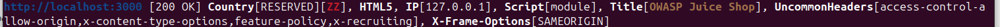
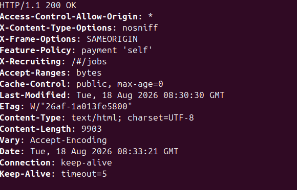
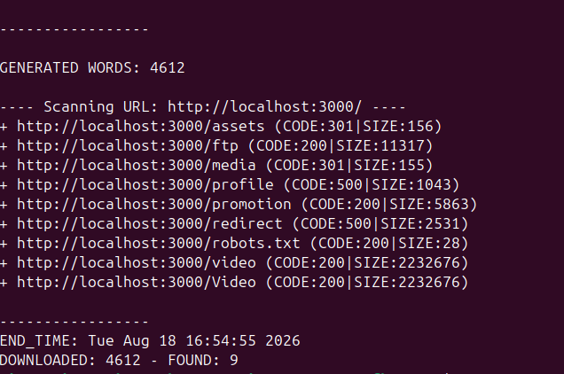
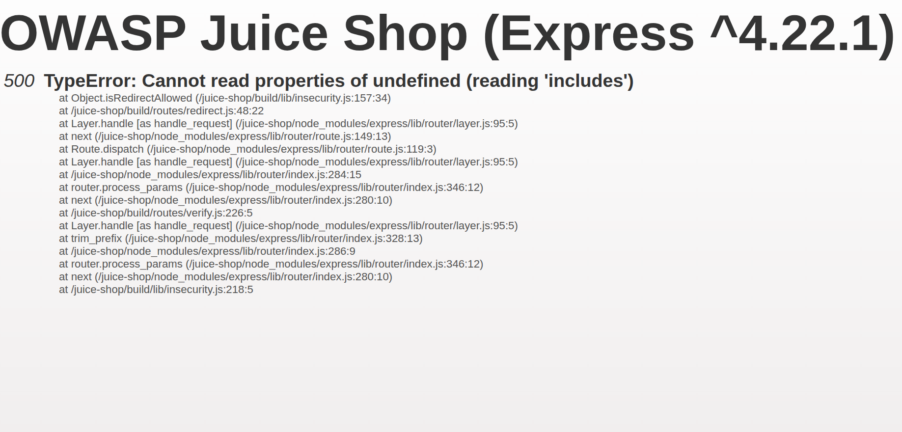
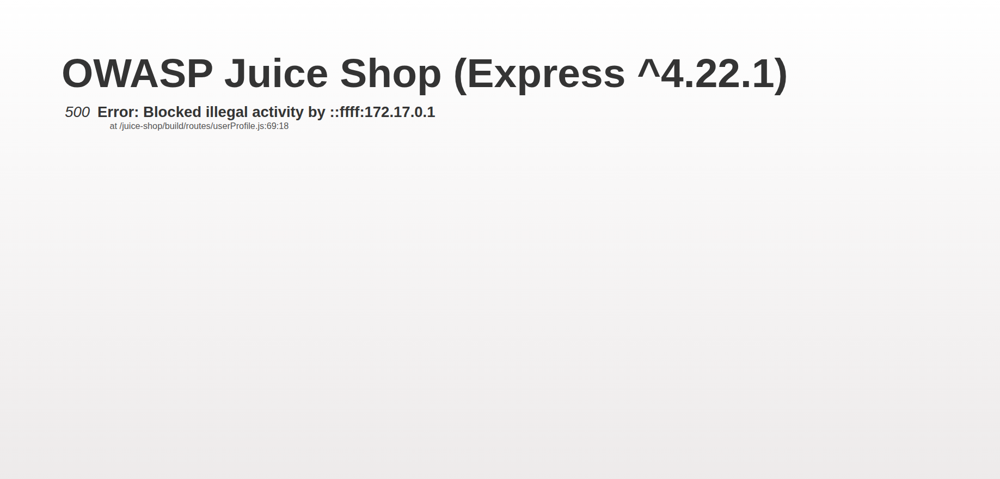
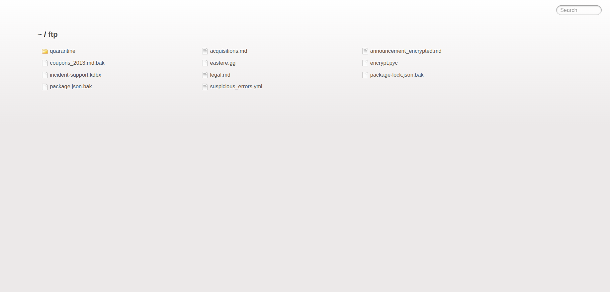

# OWASP Juice Shop - Information Disclosure Testing

## Overview

This project documents my practical testing for identifying Information Disclosure vulnerabilities in an OWASP Juice Shop application running in my own local lab environment.

### Target

`http://localhost:3000`

### Environment

* Application: OWASP Juice Shop
* Framework: Express.js
* Target: Local Docker environment
* Testing: Authorized security testing
* Vulnerability Category: Information Disclosure

---

## Objective

The objective of this assessment is to identify information that the application unintentionally exposes, including:

* Internal filesystem paths
* Stack traces
* Framework information
* Source-code locations
* Internal IP addresses
* Error information
* Exposed directories
* Backup files
* Potentially sensitive files

---

# Reconnaissance

The following reconnaissance techniques were performed against the local OWASP Juice Shop instance.

## 1. Technology Fingerprinting - WhatWeb

### Command

```bash
whatweb http://localhost:3000
```

WhatWeb was used to identify technologies, application information, IP information, and interesting HTTP headers exposed by the target.

### Result

```text
http://localhost:3000 [200 OK]
Country[RESERVED][ZZ]
HTML5
IP[127.0.0.1]
Script[module]
Title[OWASP Juice Shop]
UncommonHeaders[
access-control-allow-origin,
x-content-type-options,
feature-policy,
x-recruiting
]
X-Frame-Options[SAMEORIGIN]
```

### Screenshot



*Screenshot captures the WhatWeb technology fingerprinting results for the OWASP Juice Shop application.*

---

## 2. HTTP Header Analysis - cURL

### Command

```bash
curl -I http://localhost:3000
```

The response headers were inspected for security-related and application-specific information.

### Important Headers Identified

```text
Access-Control-Allow-Origin: *
X-Content-Type-Options: nosniff
X-Frame-Options: SAMEORIGIN
Feature-Policy: payment 'self'
X-Recruiting: /#/jobs
```

### Screenshot



*Screenshot captures the HTTP response headers returned by the OWASP Juice Shop application.*

---

## 3. Directory Enumeration - DIRB

### Command

```bash
dirb http://localhost:3000
```

### Wordlist

```text
/usr/share/dirb/wordlists/common.txt
```

### Results

```text
/assets       → 301
/ftp          → 200
/media        → 301
/profile      → 500
/promotion    → 200
/redirect     → 500
/robots.txt   → 200
/video        → 200
/Video        → 200
```

DIRB scanned 4612 words and identified 9 resources.

### Screenshot



*Screenshot captures the DIRB directory enumeration results and the resources discovered on the target.*

---

# Burp Suite Testing

Burp Suite was used to inspect HTTP requests and responses generated while interacting with the application.

The responses were reviewed for:

* Verbose error messages
* Stack traces
* Internal filesystem paths
* Source-code information
* Internal IP information
* Sensitive information
* Exposed application resources

---

# Browser Validation

The endpoints discovered during reconnaissance were manually opened and inspected in the browser.

The following endpoints were investigated:

* `/redirect`
* `/profile`
* `/ftp`

---

## `/redirect`

The `/redirect` endpoint returned a verbose error containing internal application paths and source-code information.

### Observed Information

The response exposed information such as:

* Express.js framework information
* Internal application paths
* Source-code filenames
* Function names
* Source-code line numbers
* Node.js module paths

### Screenshot



*Screenshot captures the `/redirect` error response showing the verbose stack trace and internal application source-code paths.*

---

## `/profile`

The `/profile` endpoint returned an error containing an internal source-code path, line number, and IP information.

### Observed Information

The response exposed:

* Internal source-code path
* Source-code line number
* Verbose application error
* IP information

The IP appeared in IPv4-mapped IPv6 format:

```text
::ffff:172.17.0.1
```

### Screenshot



*Screenshot captures the `/profile` error response showing the internal source-code location and verbose error information.*

---

## `/ftp`

The `/ftp` endpoint was identified through directory enumeration and manually opened in the browser.

The directory displayed multiple files, including backup files and other potentially interesting resources.

### Screenshot



*Screenshot captures the accessible `/ftp` directory and the files exposed within the directory.*

---

# Findings

## Finding 01 - Verbose Error / Stack Trace Disclosure

### Endpoint

`http://localhost:3000/redirect`

The application returned a verbose error response containing internal implementation details.

### Information Disclosed

* Express.js framework information
* Internal filesystem paths
* Source-code filenames
* Function names
* Source-code line numbers
* Node.js module paths

### Impact

The disclosed information can help an attacker understand the internal application structure and identify areas for further testing.

### Recommendation

Return generic error messages to users and keep detailed debugging information in server-side logs.

---

## Finding 02 - User Profile Error Information Disclosure

### Endpoint

`http://localhost:3000/profile`

The application returned an error containing internal application information.

### Information Disclosed

* Internal source-code path
* Source-code line number
* Verbose application error
* IP information

### Impact

The disclosed information can help an attacker understand the application's internal structure.

### Recommendation

Return a generic error message to the client and keep detailed debugging information in server-side logs.

---

## Finding 03 - Exposed FTP Directory

### Endpoint

`http://localhost:3000/ftp`

The `/ftp` directory was accessible and displayed multiple files.

### Classification

**Exposed Directory / Potential Information Disclosure**

The accessibility of the directory alone does not prove that sensitive information has been disclosed. The contents of individual files should be validated separately.

### Impact

An exposed directory can reveal files that were not intended to be directly accessible through the web application.

### Recommendation

* Remove unnecessary files from publicly accessible directories.
* Do not store backup files in the web root.
* Store sensitive files outside web-accessible directories.
* Restrict access to sensitive files.
* Disable directory listing where it is not required.

---

# Testing Summary

| Test                           | Tool                 | Result                            |
| ------------------------------ | -------------------- | --------------------------------- |
| Technology Fingerprinting      | WhatWeb              | Completed                         |
| HTTP Header Analysis           | cURL                 | Completed                         |
| Directory Enumeration          | DIRB                 | Completed                         |
| HTTP Request/Response Analysis | Burp Suite           | Completed                         |
| Browser Validation             | Browser              | Completed                         |
| `/redirect` Testing            | Browser / Burp Suite | Information Disclosure identified |
| `/profile` Testing             | Browser / Burp Suite | Information Disclosure identified |
| `/ftp` Testing                 | Browser              | Exposed directory identified      |

---

# Key Learning

Discovery of a resource does not automatically mean it is a vulnerability.

For example:

```text
/ftp → 200 OK
```

only confirms that the directory is accessible.

Similarly:

```text
500 Internal Server Error
```

does not automatically mean Information Disclosure.

The response must be manually inspected to determine whether useful internal or sensitive information is actually exposed.

In this assessment:

* `/redirect` was manually validated and found to expose stack-trace and source-code information.
* `/profile` was manually validated and found to expose internal source-code and error information.
* `/ftp` was confirmed to be accessible and contained multiple files requiring further investigation.

---

# Conclusion

The assessment identified Information Disclosure through verbose error responses and exposed internal application information.

The main observations were:

1. Verbose stack trace disclosure through `/redirect`.
2. Internal source-code and error information disclosure through `/profile`.
3. An exposed `/ftp` directory containing multiple files requiring further investigation.

All testing was performed against an OWASP Juice Shop instance running in my own local lab environment.

---

# Project Structure

```text
OWASP-Juice-Shop-Information-Disclosure/
│
├── README.md
│
└── screenshots/
    ├── 01-whatweb.png
    ├── 02-curl-headers.png
    ├── 03-dirb-results.png
    ├── 04-redirect-error.png
    ├── 05-profile-error.png
    └── 06-ftp-directory.png
```
